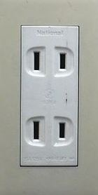
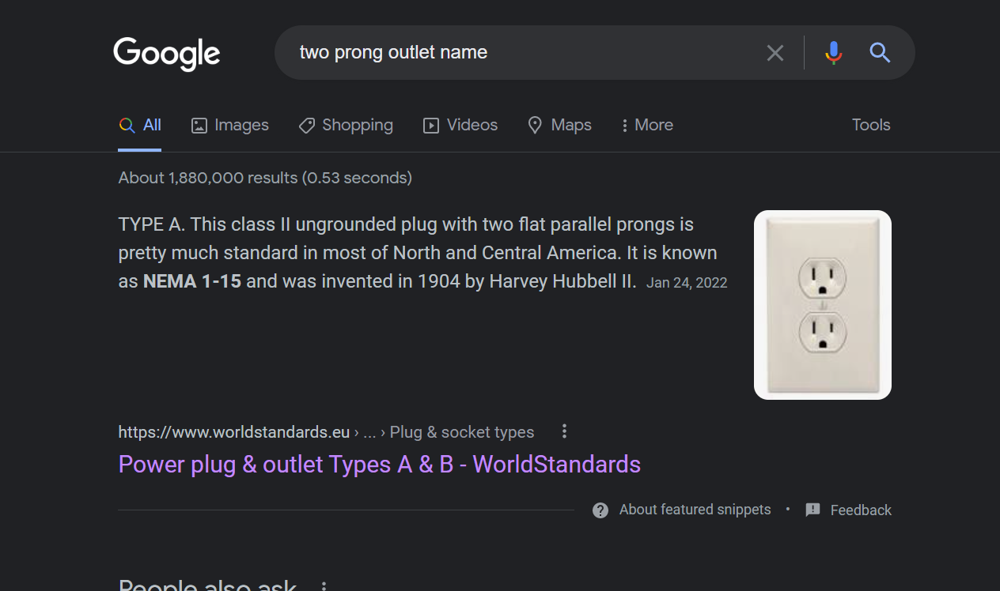

# Challenge
We have to find the type of outlet as in the provided picture. 

# Solution
First I googled `two prong outlet name`. 

The results told me it was called a `Type A` outlet. The flag was `t3n4ci0us{A_outlet}`. 