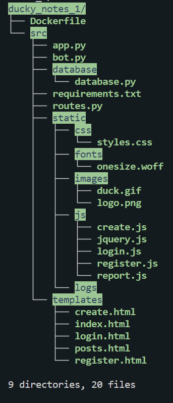
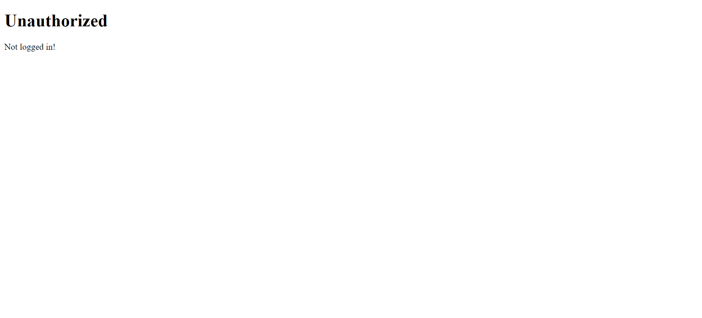
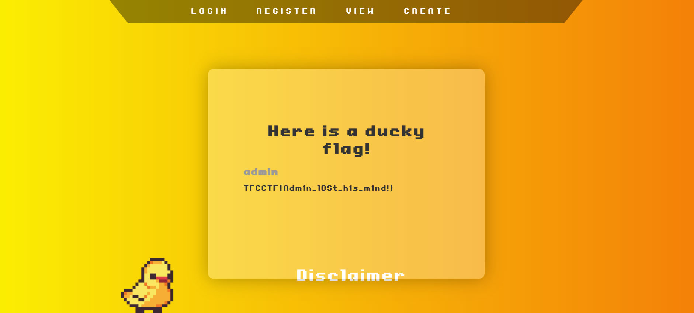

# Challenge

We are given a website to create and read blog posts and source code for this website. This website makes you login before creating a username and password. In order to login you must have a registered account.

Looking at the file breakdown of the source code for this website, we see that it seems to be a python flask website. 


# Database
Looking at the source code for the website, we see `src/database/database.py` which seems to hold the posts and users for the website. Looking at the database initalizer, we see that the flag is stored as a post for the the user with id 1. We also see that an admin user is created in this initializer and presumably has user_id 1.
```Python
# src/database/database.py
def db_init():
    con = sqlite3.connect('database/data.db')
    # Create users database
    query(con, '''
    CREATE TABLE IF NOT EXISTS users (
        id integer PRIMARY KEY,
        username text NOT NULL,
        password text NOT NULL
    );
    ''')
            
    query(con, f'''
    INSERT INTO users (
        username,
        password
        ) VALUES (
            'admin',
            '{os.environ.get("ADMIN_PASSWD")}'
        
    );
    ''')
    
    # Create posts database
 
    query(con, ''' 
    CREATE TABLE IF NOT EXISTS posts (
        id integer PRIMARY KEY,
        user_id integer NOT NULL,
        title text,
        content text NOT NULL,
        hidden boolean NOT NULL,
        FOREIGN KEY (user_id) REFERENCES users (id)
    );
    ''')


    query(con, f''' 
    INSERT INTO posts (
        user_id,
        title,
        content,
        hidden
        ) VALUES (
            1,
            'Here is a ducky flag!',
            '{os.environ.get("FLAG")}',
            0
        
    );
    ''')
```

# Routing
We know we want to see posts for the user `admin`, so we look at `src/routes.py` which seems to contain the website routing. Looking at the `posts_view(username, user)` function, we see it returns the posts of the user contained in the url. 

```Python
@web.route('/posts/view/<user>', methods=['GET'])
@auth_required
def posts_view(username, user):
    try:
        posts = db_get_user_posts(user, username == user)
    except:
        raise Exception(username)

    return render_template('posts.html', posts=posts)
```

# Admin Posts
We know we should view `/posts/view/admin` to see the flag. Trying this we are notified we need to login.


# Account Creation
We go to `/register` and fill out the form to create an account. We then go to the `/login` page and fill out the form to login with the account we just made.

# Flag
Now that we are logged in we go to `/posts/view/admin` again to see the flag.
