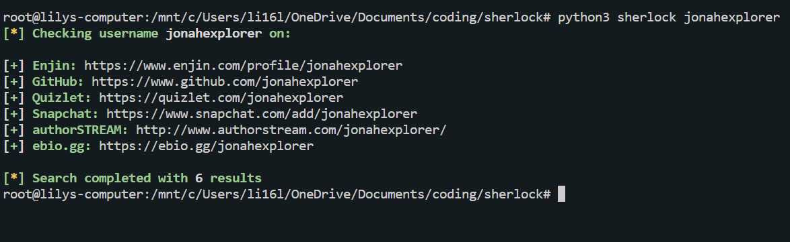
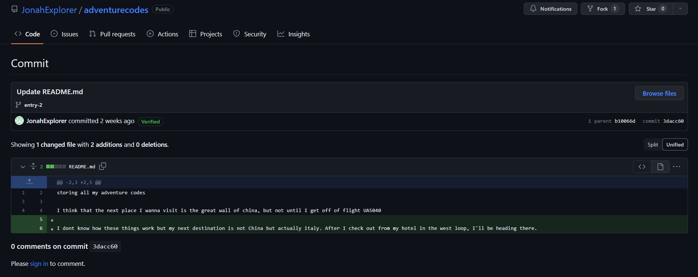

# Challenge
We need to find what country Jonah is travelling to next from his online diary that he just pushed changes to. We know that his usernames have been relatively similar and that his Twitter username was `@jonahexplorer`. 

# Sherlock
We can use Sherlock to find reused usernames accross diferent websites.

# GitHub
Since we know Jonah `pushed` his changes to his online diary, we decide to look at GitHub first.

# Adventure Code Repository
We decide to look at the only repository. 

# Branches
We notice there are two branches. 

# Entry 2 
We click on the `entry-2` branch and notice it's 2 commits ahead of main.

# Old Commits
We decide to look at old commits and notice the next country Jonah is going to is Italy. We format the flag: `uiuctf{italy}`.
