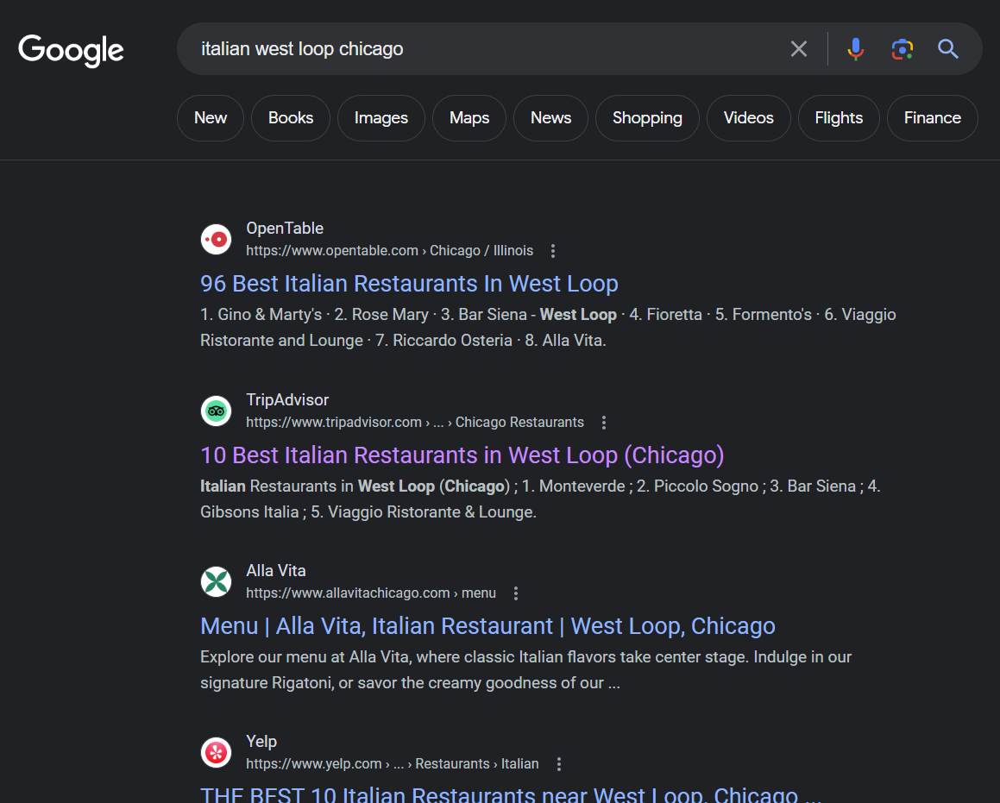
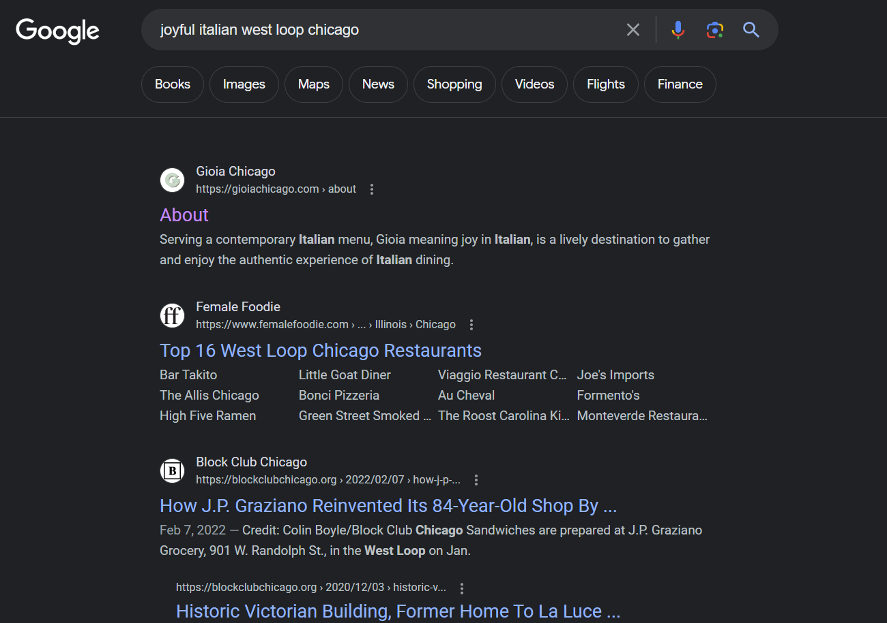
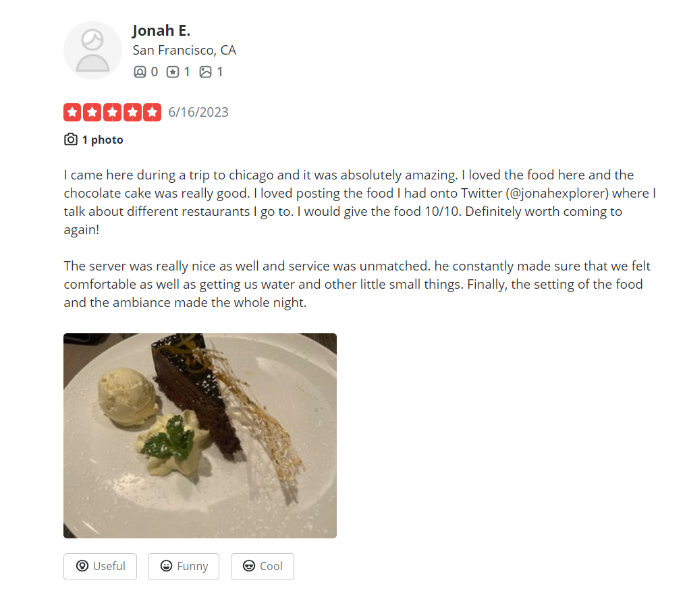

# Challenge
We need to find the online profile of Jonah Explorer who was spotted eating at a joyful Italian restaurant in West Loop, Chicago. We also know that Jonah is a food and travel blogger who enjoys reviewing restaurants and document his travel.

# Initial Google Search
We decide to first identify the resturant that Jonah ate at. We first search for an Italian resturant in West Loop, Chicago: `italian west loop chicago`. However, there appears to be many Italian resturants there.

# Refined Google Search
We know we need to sort through these Italian resturants and notice that the challenge described the resturant as `joyful`, so we try the search again with this information: `joyful`.

# Yelp Search
After finding the Gioia Resturant, we know that Jonah may have eaten there and left a review. We also know that a common website to leave food reviews on is Yelp. So we find the Gioia Resturant on Yelp which is listed as Gioia Ristorante Pastificio (a slightly different name). We then check the reviews and we find a review by Jonah E.

# Twitter
We read the review and notice it mentions a Twitter account: `@jonahexplorer`. So we search for this Twitter account and notice that it has the flag posted on it.
