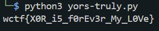

# Challenge

We need to find the key.
```Python
import base64

plaintext = "A string of text can be encrypted by applying the bitwise XOR operator to every character using a given key"
key = "" # I have lost the key!

def byte_xor(ba1, ba2):
    return bytes([_a ^ _b for _a, _b in zip(ba1, ba2)])

ciphertext_b64 = base64.b64encode(byte_xor(key.encode(), plaintext.encode()))

ciphertext_decoded = base64.b64decode("NkMHEgkxXjV/BlN/ElUKMVZQEzFtGzpsVTgGDw==")
```

# Decryption
We keep `plaintext` and `byte_xor(ba1,ba2)` for our own use. We also know that `NkMHEgkxXjV/BlN/ElUKMVZQEzFtGzpsVTgGDw==` is the ciphertext encoded in `base64`.
```python
import base64

plaintext = "A string of text can be encrypted by applying the bitwise XOR operator to every character using a given key"
ciphertext_b64 = 'NkMHEgkxXjV/BlN/ElUKMVZQEzFtGzpsVTgGDw=='
key = "" # I have lost the key!

def byte_xor(ba1, ba2):
    return bytes([_a ^ _b for _a, _b in zip(ba1, ba2)])

```

First we decode `ciphertext_b64`.
```python
ciphertext =  base64.b64decode(ciphertext_b64)
```python

Now that `ciphertext` is decoded, we can XOR it with the `plaintext` to find the `key`.
```python
key = byte_xor(ciphertext, plaintext.encode())
key = key.decode()

print(key)
```

# Flag
The flag is `wctf{X0R_i5_f0rEv3r_My_L0Ve}`.
