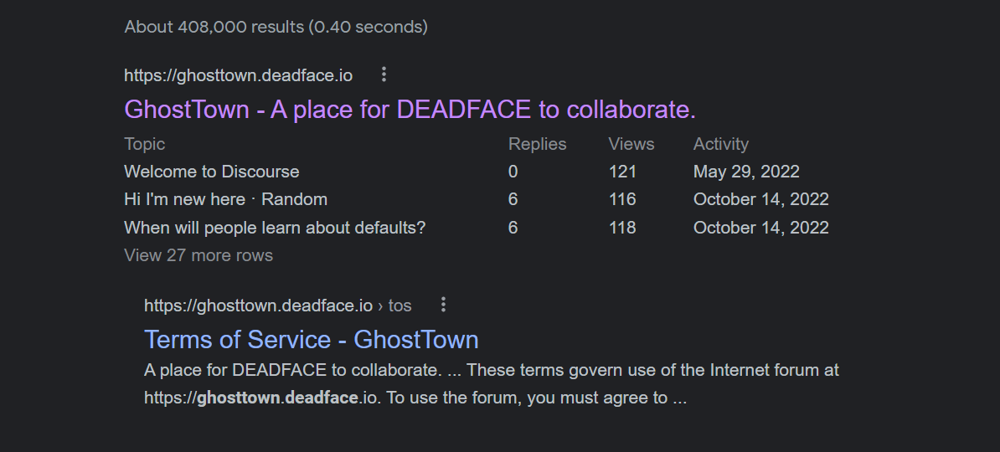
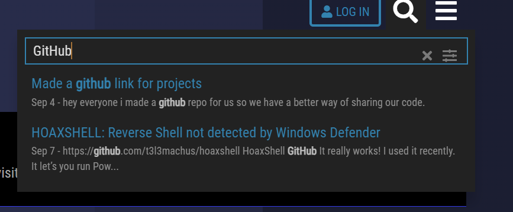
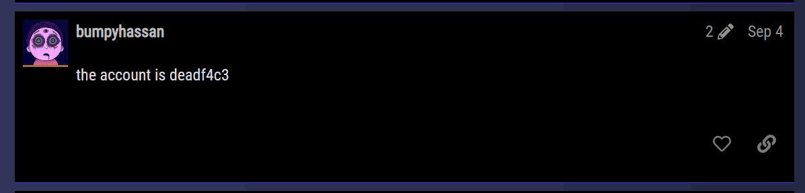
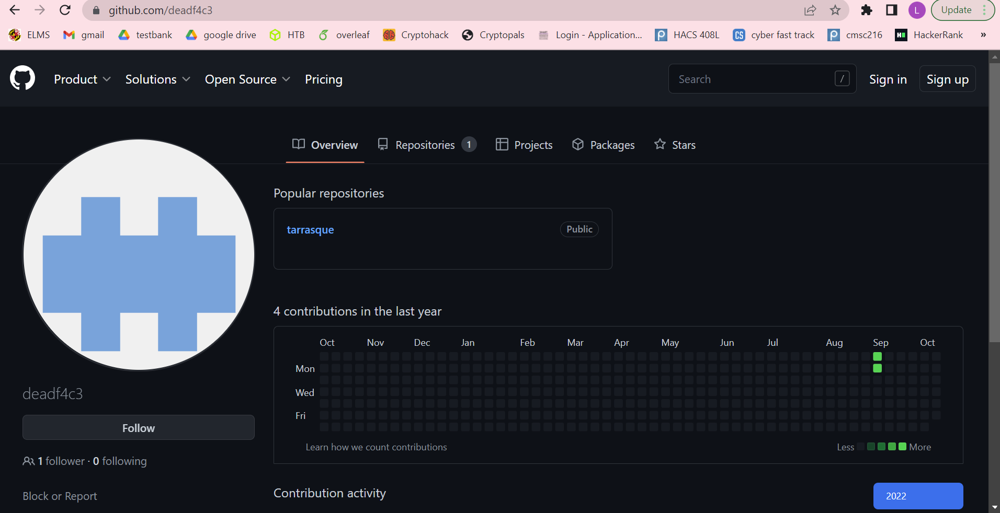
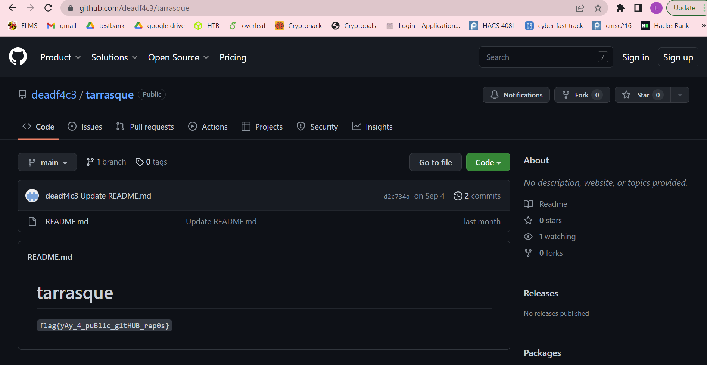

# Challenge
We have to find the GitHub of the DEADFACE CTF that they mentioned on Ghost Town.

# Ghost Town
The first thing we did was Google search for `Ghost Town DEADFACE`.

# Ghost Town Content Search
Once we went to the Ghost Town website, the next thing we did was search for GitHub. 

# Reading the Thread
Next we looked at the first search result and read the entire thread. We noticed that user `bumpyhassan` said that the account is `deadf4c3`. 

# GitHub
Then we went to `www.github.com/deadf4c3`.

# Flag
We noticed they had one repository `tarrasque`. We chose that repository and found the flag.

