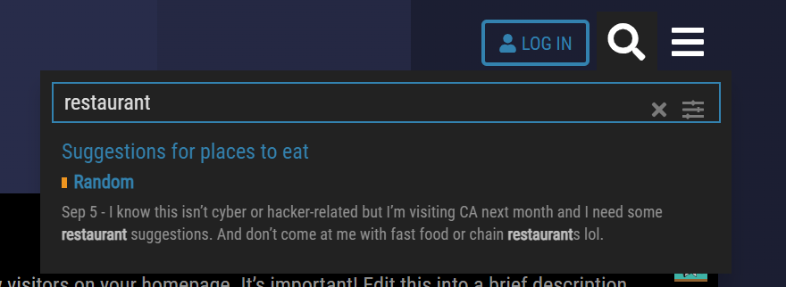

# Challenge
In Ghost Town a member talked about how their dad owned a restaurant. We need to find out where the restaurant is located and where the member may have lived.

# Ghost Town
The first thing we did was Google search for `Ghost Town DEADFACE`.

# Ghost Town Restaurant Search
Then once on the Ghost Town website, we used the search bar to search for `restaurant`.

# Post
Then we looked at the messages on the Ghost Town fourm and saw this one about a newspaper article.

# Newspaper
We then looked at the newspaper atricle and found the flag `flag{b1sh0p-pig-n_T4LL}`.
