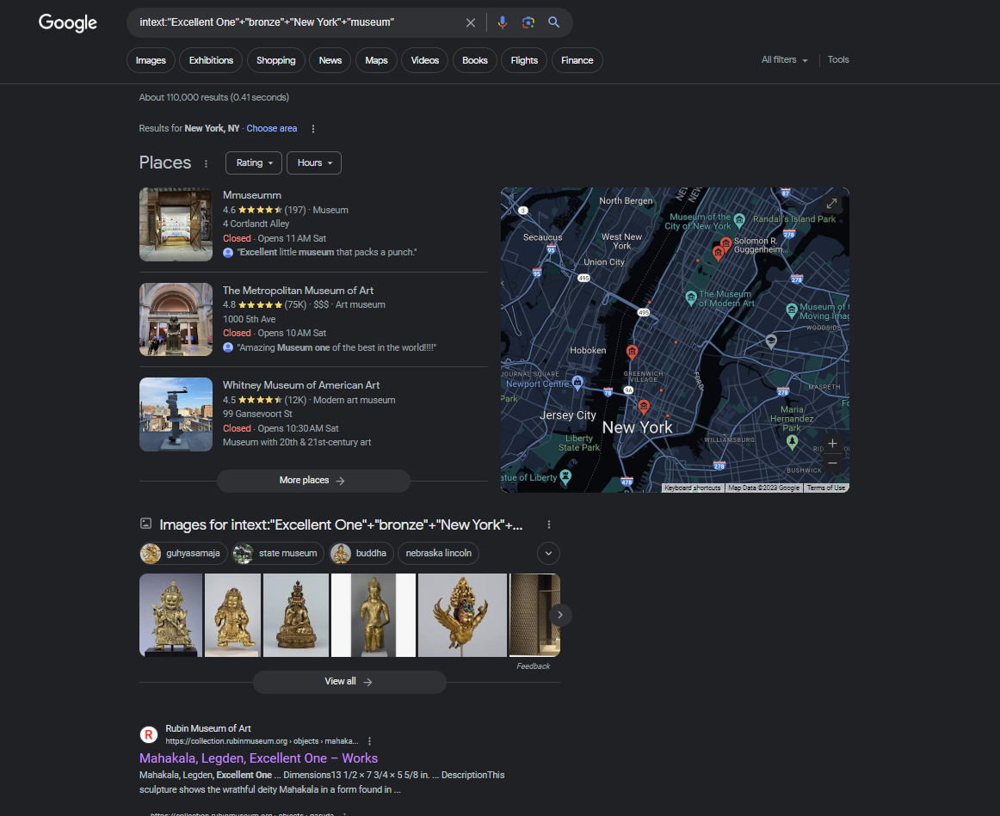
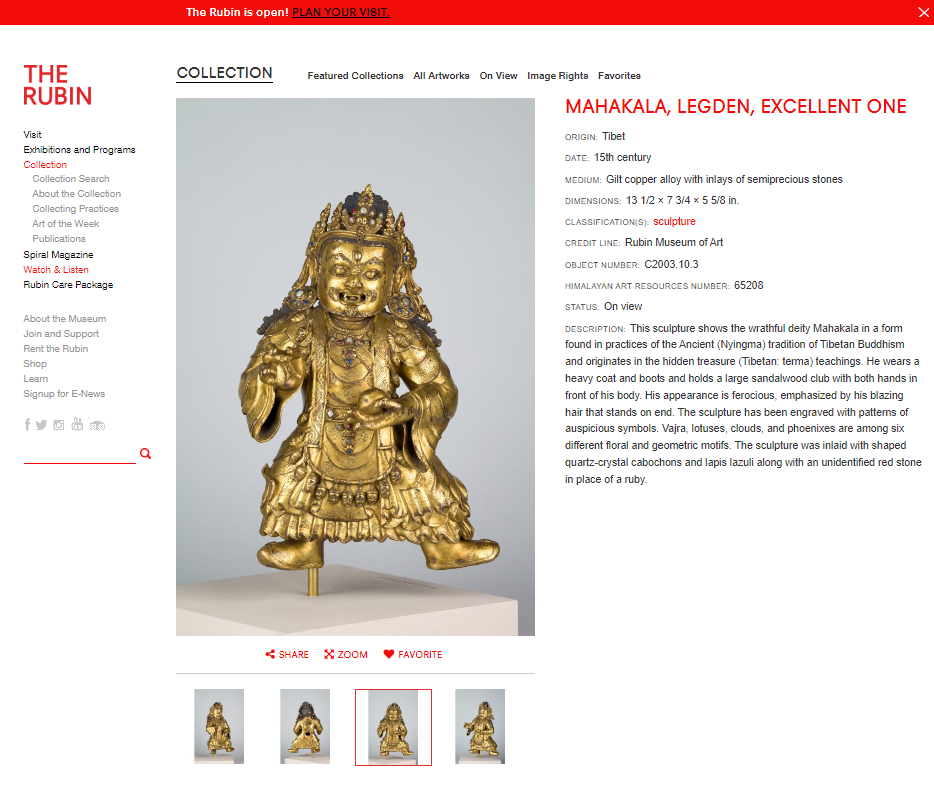

# Challenge
We need to find the New York museum that the bronze statue of the “Excellent One” is displayed in. 

# Search
First we use Google dork operators to search for the the statue. We know the statue is bronze and located in a museum in New York and that this information will probably be included on a website displaying the statue. So we use `intext` with strings `Excellent One`,  `bronze`, `New York`, and `museum`: `intext:"Excellent One"+"bronze"+"New York"+"museum"`.

# Website
We decide to look further into the first website that Google located. 

# Flag
Since there is a bronze statue of the Excellent One displayed in the Rubin Museum of Art, we try this museum as the flag formatted in the structure `uiuctf{rubin_museum_of_art}`.
