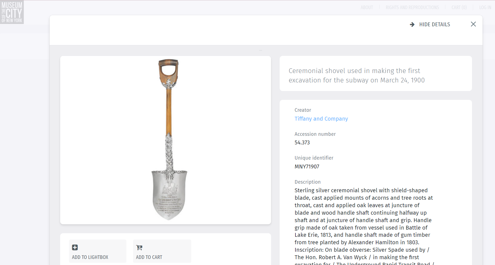

# Challenge
We need to find the museum where the first ever shovel was used to start digging the subway is displayed in. 

# Search
First we conduct a Google search using quotation operator marks. We know that the shovel was used to start digging the New York subway and that this information will probably be included on a website displaying the shovel. So we use encase strings inside quote Google operators `shovel`,  `subway`, `new york`, and `museum`: `"shovel" "subway" "new york"`.

# Website
We decide to look further into the first website that Google located. 

# Flag
Since there is a shovel first used to begin digging the New York subway displayed in the Museum of the City of New York, we try this museum as the flag formatted in the structure `uiuctf{museum_of_the_city_of_new_york}`.
